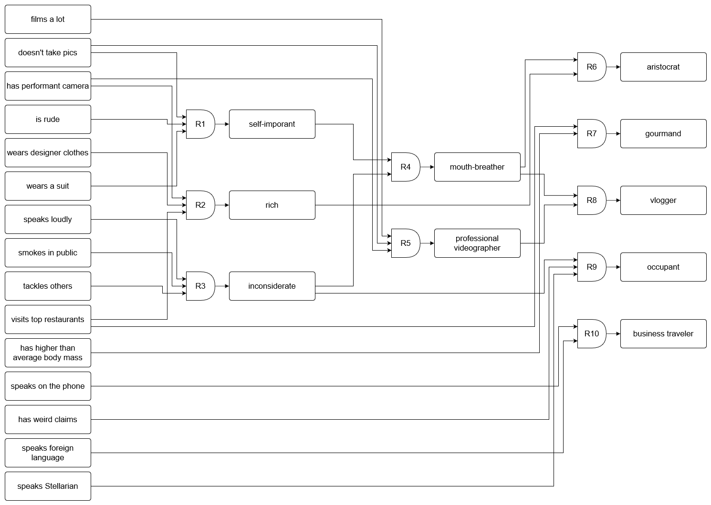

# FIA Laboratory Work No. 1
## Topic: Expert Systems

### Tasks:
1. [x] Define at least 5 types of tourists that visit Luna-City. Draw the Goal Tree representing these types of tourists.
2. [x] Implement the rules from the defined tree in Task 1 in your code (use the IF, AND, OR and THEN rules which are already implemented).
3. [x] If you are using the provided code, check how the Forward Chaining algorithm works and illustrate an example. If you are implementing your own code, implement the Forward Chaining algorithm yourself.
4. [x] Implement the Backward Chaining algorithm for the Goal Tree.
5. [x] Implement a system for generating questions from the Goal Tree. Have at least 3 types of questions (e.g. yes/no, multiple choice, etc).
6. [x] Wrap up everything in an interactive Expert System that will dynamically ask questions based on the input from the user. Both Forward Chaining and Backward Chaining should be working.
7. [x] Format the output and questions in a human-readable format (they should respect the grammatical rules of the English language).

### Goal Tree


### Forward Chaining Example


### 1. Program Run:
**Run command**
```bash
python3 main.py
```

**Output**
```
Select the type of reasoning you want to use:
[1] Forward chaining
[2] Backward chaining
[0] Exit
Enter your choice: 
> 
```

### 2.1 Forward Chaining
**Example Output**
```
Forward chaining
What's the tourist's name?
>Bob
Which of the following facts do you agree with?
[1] Bob tackles others
[2] Bob wears designer clothes
[3] Bob doesn't take pictures
[4] Bob visits top restaurants
[5] Bob smokes in public
>2 3 5
On a scale of 1-10, how much do you agree that Bob visits top restaurants?
[1-10]>1
Do you agree that Bob is rude? [y/n]
[y/n] >y
Do you agree that Bob tackles others? [y/n]
[y/n] >y
On a scale of 1-10, how much do you agree that Bob speaks loudly?
[1-10]>8
Do you agree that Bob speaks Stellarian? [y/n]
[y/n] >n
Do you agree that Bob wears a suit? [y/n]
[y/n] >n
Do you agree that Bob has a performant camera? [y/n]
[y/n] >y
Do you agree that Bob films a lot? [y/n]
[y/n] >y
On a scale of 1-10, how much do you agree that Bob has weird claims?
[1-10]>3
Conclusion: Bob is a vlogger
```

### 2.2 Backward Chaining
**Example Output**
```
Backward chaining
Hypothesis:
>John is an occupant
John speaks loudly OR John smokes in public OR John tackles others
John has weird claims
John speaks Stellarian
```
